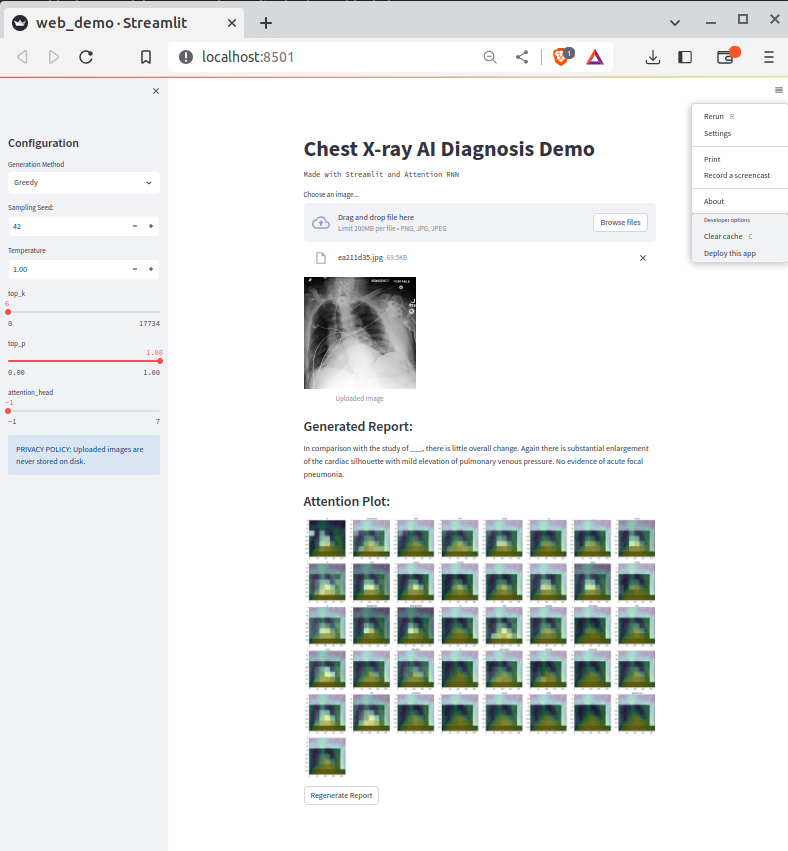

# RATCHET: RAdiological Text Captioning for Human Examined Thoraxes

RATCHET is a Medical Transformer for Chest X-ray Diagnosis and Reporting. Based on the architecture featured in [Attention Is All You Need](https://papers.nips.cc/paper/7181-attention-is-all-you-need.pdf). This network is trained and validated on the MIMIC-CXR v2.0.0 dataset.


### Architecture

<p align="center">
  
</p>


### Run the code

1. Download pretrained weights, unzip them and put them in `./checkpoints` folder.

- [ratchet_model_weights_202303111506.zip](http://www.doc.ic.ac.uk/~bh1511/ratchet_model_weights_202303111506.zip)
<br> Size: `1.5G` <br> MD5: `26ab19cf18908841320205e192dabe9f` <br>

- [ratchet_model_weights_202309022247.zip](http://www.doc.ic.ac.uk/~bh1511/ratchet_model_weights_202309022247.zip)
<br> Size: `695M` <br> MD5: `e028c1551419c059f62b1598e8ef92f3` <br>

Start streamlit to run the webapp:

2. Start streamlit to run the webapp:

```bash
streamlit run web_demo.py
```

<p align="center">
  
</p>


##### Environment
See installation steps [here](dependencies)
```bash
uv sync
```


### Docker Container

Build the docker container:

```
docker build -t ratchet ./Dockerfile
```

Run the docker image on CXR images:

```
docker run --user $(id -u):$(id -g) \
-v /path/to/image_input_folder:/code/RATCHET/inp_folder \
-v /path/to/report_output_folder:/code/RATCHET/out_folder:rw \
-i -t ratchet python run_model.py
```

Each image in `inp_folder` would have a corresponding `.txt` report saved in `out_folder`.


### Results

<p align="center">
  &nbsp;&nbsp;&nbsp;&nbsp;
  
  &nbsp;&nbsp;&nbsp;&nbsp;
  &nbsp;&nbsp;&nbsp;&nbsp;
  
  &nbsp;&nbsp;&nbsp;&nbsp;
</p>


##### Generated Text: 

> In comparison with the study of \_\_\_, there is little overall change. Again there is substantial enlargement of the cardiac silhouette with a dual-channel pacer device in place. No evidence of vascular congestion or acute focal pneumonia. Blunting of the costophrenic angles is again seen.


### More Examples

<p align="center">
  
</p>

### References

> Hou, Benjamin, Georgios Kaissis, Ronald M. Summers, and Bernhard Kainz. "Ratchet: Medical transformer for chest x-ray diagnosis and reporting." In Medical Image Computing and Computer Assisted Intervention–MICCAI 2021: 24th International Conference, Strasbourg, France, September 27–October 1, 2021, Proceedings, Part VII 24, pp. 293-303. Springer International Publishing, 2021.  https://arxiv.org/abs/2107.02104 google-scholar: https://scholar.google.com/scholar?cites=6324608147072853701 
